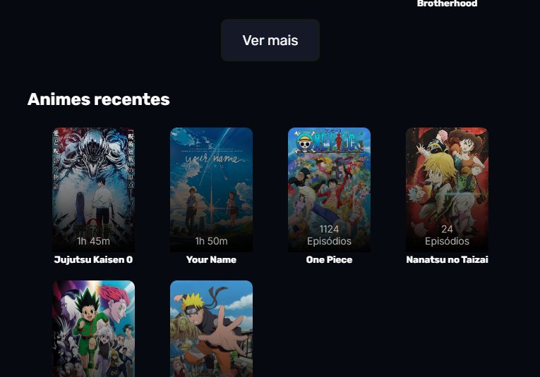
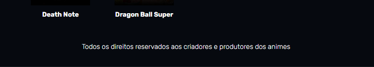

<h1>Sobre o projeto</h1>

Ani.me é um mini projeto que faz parte de uma atividade proposta pela Digital College, onde o objetivo era criar uma landing page responsiva para uma página web utilizando apenas HTML + CSS na sua criação.

><h3>*OBS:</h3>
>
Responsividade está funcionando somente para larguras de tela entre <strong>768px</strong> a <strong>1440px</strong>.

<h1>Bem vindo ao Ani.me!</h1>

Com isso, apresento o Ani.me, um site de animes onde é possível encontrar diversos animes no nosso catálogo, utilizando de ferramentas de busca como nosso ícone de pesquisa, com os filtros por inicial, por meio dos botões na parte superior da página ou clicando em <strong>Ver mais</strong> abaixo do catálogo.

Também é possível descobrir novos títulos na seção de <strong>Ultimas novidades</strong> ou <strong>Animes recentes</strong>.

Já na página do player, é possível visualizar informações sobre o episódio que está assistindo no momento, informações como: duração do episódio, estúdio, gênero e uma sinopse.

Também na página do player, existe a seção de <strong>comentários</strong>, onde você pode interagir com outros usuários ou procurar novos animes na parte de <strong>Relacionados</strong>.

><h3>*Nota</h3>
>
É possível se direcionar para a página do player ou a Página principal apenas clicando no texto do rodapé.

><h3>*OBS:</h3>
>
<strong>**Essa função não é permanente**</strong> 

<h1>Pré-visualização do site.</h1>

><h2>Página principal</h2>

><h2>Página do Player</h2>

